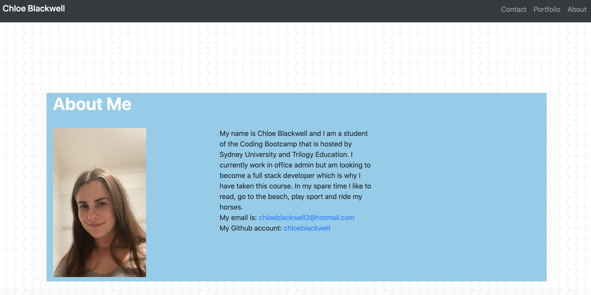
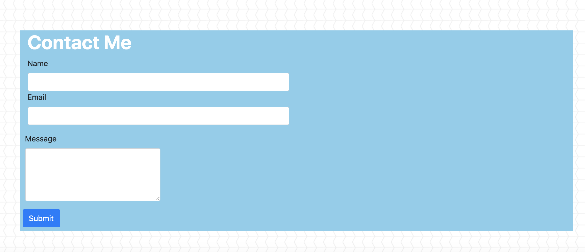
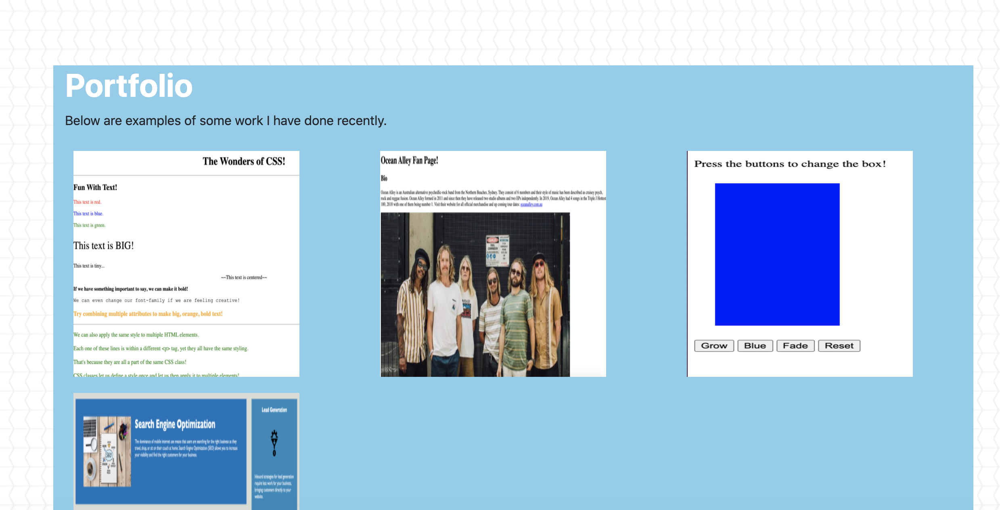

# Responsive-Portfolio-Task

For this assignment, we are tasked to make a responsive website. The website needs to be responsive so that a user can view it on a variety of devices and window or screen sizes.  

## Contents 

This webpage consists of 4 pages, index.html, contact.html, portfolio.html and style.css. It also has images that are within the image folder. 

## User Story 

A USER visits webpage 
WEBPAGE renders to device used 

## Built With 

* VS Code (hhtps://code.visualstudio.com/)
* Terminal 

## Screenshots 

## License 

This page does not have a license. 

## Link to the Webpage 

  
## Author 

Chloe Blackwell 
Email: chloeblackwell2@hotmail.com
